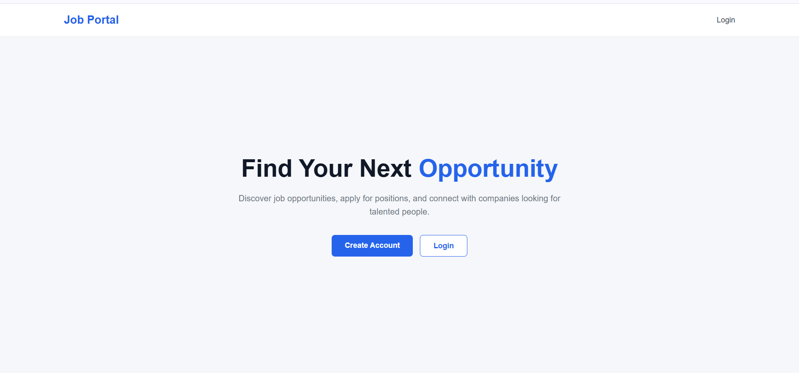
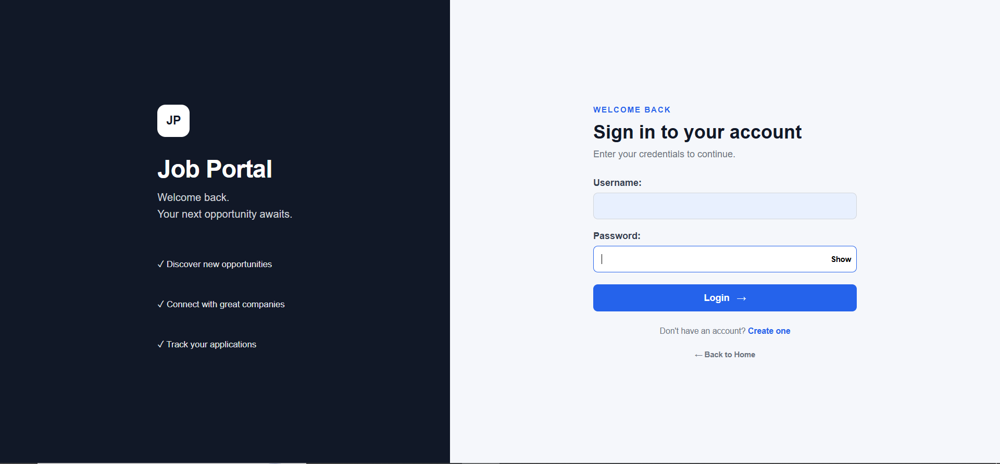
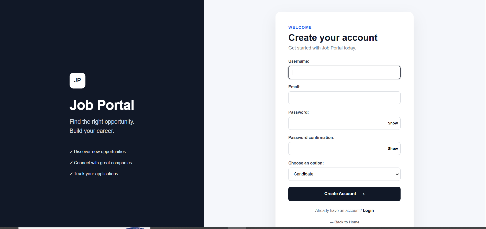

# Job Portal

A full-stack job portal built with Django and Django REST Framework.

Candidates can create profiles, upload resumes, browse jobs, apply for jobs, and track their applications. Recruiters can create and manage job postings, view applicants, and update application statuses.

The project also provides REST APIs with JWT authentication, role-based permissions, validation, pagination, search, filtering, ordering, and Swagger/OpenAPI documentation.

## Features

### Candidate

- Registration and authentication
- Profile management
- Resume upload
- Browse and view jobs
- Apply for jobs
- Duplicate application prevention
- Track application status

### Recruiter

- Registration and authentication
- Company profile management
- Recruiter dashboard
- Create, edit, and delete jobs
- Manage own job postings
- View applicants
- View candidate resumes
- Update application status

### REST API

- Job CRUD APIs
- Application APIs
- JWT authentication
- Role-based permissions
- Serializer validation
- Pagination
- Search
- Location filtering
- Ordering

## Tech Stack

- Python
- Django
- Django REST Framework
- PostgreSQL
- HTML
- CSS
- JavaScript
- JWT Authentication
- Swagger / OpenAPI
- ReDoc
- Postman
- Git & GitHub
- python-dotenv

## Project Structure

```text
JobPortal/
├── JobPortal/
├── accounts/
├── jobs/
├── applications/
├── templates/
├── static/
├── manage.py
├── requirements.txt
├── .env.example
├── .gitignore
├── README.md
└── LICENSE
```

## REST API Endpoints

### Jobs

| Method | Endpoint | Description |
|---|---|---|
| GET | `/jobs/job_list_api/` | List jobs |
| POST | `/jobs/job_list_api/` | Create a job |
| GET | `/jobs/job_detail_api/<job_id>/` | Get job details |
| PUT | `/jobs/job_detail_api/<job_id>/` | Update a job |
| PATCH | `/jobs/job_detail_api/<job_id>/` | Partially update a job |
| DELETE | `/jobs/job_detail_api/<job_id>/` | Delete a job |

### Applications

| Method | Endpoint | Description |
|---|---|---|
| POST | `/applications/apply_job_api/<job_id>/` | Apply for a job |
| GET | `/applications/application_list_api/` | List applications |
| GET | `/applications/application_detail_api/<application_id>/` | Get application details |
| PATCH | `/applications/application_detail_api/<application_id>/` | Update application |

## API Features

### Authentication

REST APIs use JWT authentication.

Authenticated requests use:

```text
Authorization: Bearer <access_token>
```

### Authorization

Role-based permissions restrict candidate and recruiter operations.

### Search

Jobs can be searched by title, description, or skills.

Example:

```text
/jobs/job_list_api/?search=python
```

### Location Filtering

```text
/jobs/job_list_api/?location=Chennai
```

### Ordering

```text
/jobs/job_list_api/?ordering=salary
/jobs/job_list_api/?ordering=-salary
/jobs/job_list_api/?ordering=created_at
/jobs/job_list_api/?ordering=-created_at
```

### Pagination

```text
/jobs/job_list_api/?page=2
```

## API Documentation

### Swagger UI

`http://127.0.0.1:8000/api/docs/`

### OpenAPI Schema

`http://127.0.0.1:8000/api/schema/`

### ReDoc

`http://127.0.0.1:8000/api/redoc/`

## Database

The project uses PostgreSQL.

### Main Models

- CandidateProfile
- RecruiterProfile
- Job
- Application

The `Application` model prevents duplicate applications for the same candidate and job.

## Getting Started

### 1. Clone the repository

```bash
git clone https://github.com/madhanravi734/django-job-portal.git
cd django-job-portal
```

### 2. Create a virtual environment

#### Windows

```bash
python -m venv .venv
.venv\Scripts\activate
```

#### macOS/Linux

```bash
python3 -m venv .venv
source .venv/bin/activate
```

### 3. Install dependencies

```bash
python -m pip install -r requirements.txt
```

### 4. Configure environment variables

Create a `.env` file in the project root using `.env.example` as a template.

Configure your environment variables:

```text
SECRET_KEY=your_secret_key

DB_NAME=jobportal_db
DB_USER=postgres
DB_PASSWORD=your_postgresql_password
DB_HOST=localhost
DB_PORT=5432
```

Do not commit `.env` to GitHub.

### 5. Create the PostgreSQL database

Create a PostgreSQL database named:

```text
jobportal_db
```

Make sure PostgreSQL is running and the credentials in `.env` match your local PostgreSQL configuration.

### 6. Apply migrations

```bash
python manage.py migrate
```

### 7. Create an admin account

Optional:

```bash
python manage.py createsuperuser
```

### 8. Start the development server

```bash
python manage.py runserver
```

Open:

```text
http://127.0.0.1:8000/
```

## Main Web Routes

| Area | Route |
|---|---|
| Home | `/` |
| Login | `/accounts/login/` |
| Register | `/accounts/register/` |
| Candidate Dashboard | `/accounts/candidate-dashboard/` |
| Recruiter Dashboard | `/jobs/recruiter-dashboard/` |
| Browse Jobs | `/jobs/job_list/` |
| My Jobs | `/jobs/my_jobs/` |
| My Applications | `/applications/my-applications/` |

## Candidate Workflow

```text
Register
   ↓
Candidate Profile
   ↓
Browse Jobs
   ↓
Job Details
   ↓
Apply
   ↓
My Applications
   ↓
Logout
```

## Recruiter Workflow

```text
Register
   ↓
Company Profile
   ↓
Recruiter Dashboard
   ↓
Create Job
   ↓
My Jobs
   ↓
View Applicants
   ↓
Update Status
   ↓
Edit / Delete Job
   ↓
Logout
```

## Security & Authorization

- JWT authentication for REST APIs
- Role-based access control
- Recruiters can manage only their own jobs
- Recruiters can access applications belonging to their own jobs
- Candidates cannot perform recruiter-only operations
- Duplicate applications are prevented at the database level
- Django CSRF protection for web forms
- Sensitive configuration is stored using environment variables

## Screenshots

### Home Page



### Login



### Register



### Job Listings


### Candidate Dashboard


### Recruiter Dashboard


### Applicants Page


## Future Improvements

- React frontend integration
- Email notifications
- Password reset flow
- Automated API testing
- Production deployment
- Improved resume/document validation
- Additional API filtering
- API rate limiting

## Author

**Madhan Ravi**

Software Engineer Intern | Python | Django | Django REST Framework | React | TypeScript

## License

This project is licensed under the MIT License.
